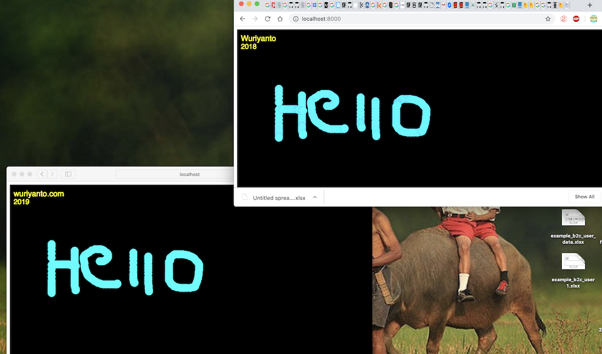

## Membangun Realtime Canvas Drawing Dengan Go, Websocket dan P5.js

<p align="center">
  
</p>

<p>Kebutuhan sistem yang realtime untuk saat ini sudah menjadi kewajiban untuk setiap aplikasi yang ingin menyediakan pengalaman mengasyikan untuk setiap penggunanya.</p>

<p>Kebutuhan pengguna tersebut bisa kita akali dengan banyak pilihan teknologi. Beberapa pilihan tersebut di antaranya <b>socket.io</b> dan <b>websocket protocol</b>. Nah pada pembahasan kali ini kita akan menggunakan <b>websocket</b> untuk membangun <b>realtime canvas drawing</b>.</p>

<p>Sedikit pembahasan tentang <b>websocket</b>, <b>websocket</b> adalah protokol yang menyediakan komunikasi <b>full duplex</b> yang artinya kedua belah pihak, dalam hal ini <b>server</b> dan <b>client</b> saling bertukar pesan dalam waktu yang bersamaan, dan <b>websocket</b>  berjalan di satu koneksi <b>TCP</b>. Kita tau, pada protokol <b>HTTP</b>, untuk membangun koneksi antara <b>server</b> dan <b>client</b>, <b>client</b>-lah yang terlebih dahulu harus mengirim koneksi ke <b>server</b>. <b>Server</b> tidak dapat mengirim informasi tanpa ada permintaan dari <b>client</b> atau <b>browser</b>. Dengan adanya protokol <b>websocket</b>, <b>server</b> dapat mengirim informasi ke <b>client</b> atau <b>browser</b> tanpa <b>client</b> meminta terlebih dahulu(<b>realtime</b>). Teknologi <b>websocket</b> biasanya digunakan untuk membuat aplikasi chat, realtime monitoring, kontrol jarak jauh, dll. Silahkan kunjungi <a href="https://www.websocket.org/">websitenya</a>.</p>

<p>Nah, pada pembahasan kali ini kita akan membuat studi kasus membuat <b>realtime canvas drawing</b> dengan beberapa teknologi, seperti <b>Golang</b>, <b>Gorilla Websocket</b>, dan <b>p5.js</b>. </p>
<p>berikut daftarnya teknologi yang akan kita pakai:</p>

- Golang https://golang.org/
- Gorilla Websocket https://github.com/gorilla/websocket
- P5.js https://p5js.org/

<p>kita buat projek <b>go</b> terlebih dahulu dengan <b>glide</b>, sebelumnya kita buat folder kosong dengan nama <b>socket-draw</b></p>

```shell
$ mkdir socket-draw
```
<p>kemudian masuk ke folder <b>socket-draw</b>, dan jalankan <b>glide init</b></p>

```shell
$ cd socket-draw
$ glide init
```

<p>setelah proses di atas dijalankan, kita buat <b>main.go</b> file di root projeknya.</p>

```go
package main

import (
	"log"
	"net/http"

)

func main() {

	fs := http.FileServer(http.Dir("static"))
	http.Handle("/", fs)

	log.Println("Listening...")
	http.ListenAndServe(":8000", nil)
}

```

<p>kita lihat di fungsi main di atas, pada default handlernya dengan root <b>http.Handle("/", fs)</b>, kita serve <b>static file</b> yang berada di folder static. Nantinya folder <b>static</b> ini kita gunakan untuk meletakan aset-aset kita, seperti file <b>html</b>, <b>javascript</b>, <b>css</b>, dll. Jadi kita akan buat dulu folder static-nya.</p>

```shell
$ mkdir static
```

<p>Kemudian di folder <b>static</b> kita buat satu file dengan nama <b>index.html</b>, kemudian tambahkan <b>html code</b> sebagai berikut:</p>

```html
<html>
   <head>
      <title>Let's Draw</title>
   </head>
   <body>
       <p>Hello</p>
   </body>
</html>
```

<p>jalankan file <b>main.go</b></p>

```shell
$ go run main.go
```

<p>buka browser, dan kunjungi alamat <b>http://localhost:8000</b>, maka akan terlihat halaman dengan pesan <b>Hello</b>.</p>
<p>Core code kita akan kita pisahkan dengan <b>package main</b>, jadi kita perlu buat satu folder lagi dengan nama <b>core</b>. </p>

```shell
$ mkdir core
```

<p>Setelah step-step di atas kita lakukan, struktur projek kita untuk saat ini kurang lebih berbentuk sebagai berikut</p>

```
|core
|static
|  -index.html
|glide.yaml
|main.go
```

<p>Sebelum memulai koding di <b>core code</b> kita, kita akan install dependensi atau <b>package</b> yang kita perlukan. Untuk projek ini, kita hanya perlu satu <b>package</b> saja, yaitu <b>Gorilla Websocket</b>. Kita install terlebih dahulu dengan <b>glide</b></p>

```shell
$ glide get github.com/gorilla/websocket
```

<p>Pada folder <b>core</b> buat file dengan nama <b>client.go</b>, file ini nantinya akan menggambarkan setiap entitas <b>client</b> dalam hal ini adalah <b>web browser</b> yang terkoneksi dengan <b>server</b> kita.</p>

```
|core
| - core.go
|static
|  -index.html
|glide.lock
|glide.yaml
|main.go
```

<p>Buka file <b>client.go</b></p>

```go
package core

import (
	"github.com/gorilla/websocket"
)

// Client model
type Client struct {
	ID      string
	Conn    *websocket.Conn
	Send    chan []byte
	Manager *Manager
}
```

<p>Kita akan bahas satu persatu properti dari <b>struct Client</b> di atas. <b>ID</b> denga tipe <b>string</b> ini nantinya akan kita gunakan sebagai unik id untuk masing-masing <b>client</b> yang terkoneksi dengan <b>server</b> kita. Properti <b>ID</b> kita dapatkan dari <b>HTTP request header</b> dengan <b>key Sec-Websocket-Key</b>. <b>client</b> atau <b>browser</b> akan mengirimkan <b>key</b> tersebut setelah koneksi di <b>upgrade</b> dari protokol <b>HTTP</b> ke <b>websocket</b>.</p>

<p>Properti <b>Conn</b> dengan tipe <b>*websocket.Conn</b> adalah koneksi dari <b>websocket</b> itu sendiri. Karena setiap <b>client</b> memiliki koneksinya yang unik untuk setiap masing-masing dari mereka.</p>

Method <b>Read</b> milik <b>Client</b>
```go
// Read function will read incoming message from client
func (c *Client) Read() {

	// if function finish, remove client
	// and also close connection
	defer func() {
		c.Manager.Unregister <- c
		c.Conn.Close()
	}()

	for {
		// read message from client
		_, msg, err := c.Conn.ReadMessage()
		if err != nil {
			c.Manager.Unregister <- c
			c.Conn.Close()
			break
		}

		var message Message
		err = json.Unmarshal(msg, &message)
		if err != nil {
			c.Manager.Unregister <- c
			c.Conn.Close()
			break
		}

		// send broadcast
		c.Manager.BroadCast <- &message

	}

}
```

<p>Properti <b>Conn</b> digunakan oleh <b>client</b> untuk mengirim dan menerima pesan dari <b>browser</b>. Ini bisa kita lihat pada method <b>Read</b> milik <b>Client</b>.</p>

```go
....
for {
	// read message from client
	_, msg, err := c.Conn.ReadMessage()
	if err != nil {
		c.Manager.Unregister <- c
		c.Conn.Close()
		break
	}
....
```
<p>Method <b>Read</b> nantinya juga akan berjalan pada proses yang independen. Sehingga kita bisa menggunakan <b>infinite loop</b> untuk menerima pesan dari <b>_, msg, err := c.Conn.ReadMessage()</b>. Method <b>ReadMessage</b> milik <b>*websocket.Conn</b> digunakan oleh <b>Client</b> untuk membaca pesan yang dikirim oleh <b>browser</b>. Pesan yang dikirim oleh <b>browser</b> berbentuk <b>JSON</b>, jadi kita perlu <b>decode</b> pesan tersebut ke dalam struct <b>Message</b>.</p>

```go
....
var message Message
err = json.Unmarshal(msg, &message)
if err != nil {
	c.Manager.Unregister <- c
	c.Conn.Close()
	break
}

// send broadcast
c.Manager.BroadCast <- &message
....
```

<p>Setelah kita <b>decode</b>, kemudian pesan tersebut kita kirim ke <b>channel BroadCast</b> milik <b>Manager</b> untuk selanjutnya dikirim ke semua <b>client</b> yang sedang terkoneksi. Pada method <b>Read</b>, kita juga memanfaatkan <b>defer</b> untuk mengetahui <b>client</b> yang koneksinya terputus. Koneksi terputus bisa ada beberapa kemungkinan, misalnya pengguna menutup <b>browser</b>. <b>Defer</b> ini kemudian bisa di manfaatkan oleh <b>Manager</b> untuk menerima notifikasi dari <b>client</b> yang koneksinya terputus dengan mengirimkan notifikasi ke <b>channel Unregister</b>.</p>

```go
....
if err != nil {
	c.Manager.Unregister <- c
	c.Conn.Close()
	break
}
....
```

<p>Properti <b>Send</b> dengan tipe <b>chan []byte</b> digunakan oleh <b>Manager</b> untuk mengirimkan pesan ke dirinya sendiri(<b>client</b>). Disini kita menggunakan <b>Go channel</b>, karena kita akan <b>message passing</b> antar banyak proses di aplikasi kita dengan power <a href="https://tour.golang.org/concurrency/1">goroutine</a>.</p>

Method <b>Write</b> milik <b>Client</b>
```go
// Write function will write message to connected client
func (c *Client) Write() {

	defer func() {
		c.Conn.Close()
	}()

	for {
		select {
		case msg, ok := <-c.Send:
			if !ok {
				// manager closed the send channel.
				c.Conn.WriteMessage(websocket.CloseMessage, []byte{})
			}

			// write message to connected client
			err := c.Conn.WriteMessage(websocket.TextMessage, msg)
			if err != nil {
				c.Conn.Close()
			}
		}
	}
}
```

<p>Sama seperti method <b>Read</b>, method <b>Write</b> juga akan berjalan pada proses independen. Method <b>Write</b> digunakan oleh <b>Client</b> untuk mengirim pesan ke <b>browser</b>.</p>

<p>Properti <b>Manager</b> dengan tipe <b>*Manager</b> digunakan untuk memenej semua <b>client</b> yang terkoneksi, mulai dari <b>broadcast</b> pesan, mendaftarkan <b>client</b>, dan menghapus <b>client</b>. Untuk keperluan ini kita buat file <b>manager.go</b>.</p>

```
|core
| - core.go
| - manager.go
|static
|  -index.html
|glide.lock
|glide.yaml
|main.go
```

<p>Buka file <b>manager.go</b>, dan buatlah <b>struct Manager</b>:</p>

```go
package core

import (
	"sync"

	"github.com/gorilla/websocket"
)

// Manager model
type Manager struct {
	Clients    map[*Client]bool
	Register   chan *Client
	Unregister chan *Client
	BroadCast  chan *Message
	Upgrader   websocket.Upgrader
	sync.RWMutex
}
```

<p>Kita akan bahas satu-persatu properti dari <b>struct Manager</b>. <b>Clients</b> dengan tipe <b>map[*Client]bool</b> adalah <b>database</b> untuk menyimpan setiap <b>client</b> atau <b>browser</b> yang terkoneksi dengan <b>server</b> aplikasi kita. Jadi setiap <b>client</b> yang terkoneksi akan kita simpan di properti <b>Clients</b>.</p>

<p>Properti <b>Register</b> dengan tipe <b>chan *Client</b> digunakan oleh <b>Manager</b> untuk menerima data <b>client</b> yang terkoneksi, kemudian menyimpan ke <b>database Clients</b>. Bisa kita lihat di potongan kode di bawah ini:</p>

Method <b>Run</b> milik <b>Manager</b>
```go
// Run function will run Manager process
func (p *Manager) Run() {
	for {
		select {
		case client := <-p.Register:
			p.AddClient(client, true)
			....
```

Method <b>AddClient</b> milik <b>Manager</b>
```go
//AddClient function will push new client to the map clients
func (p *Manager) AddClient(key *Client, b bool) {
	p.Lock()
	p.Clients[key] = b
	p.Unlock()
}
```

<p>Ketika proses <b>Run</b> menerima notifikasi dari <b>channel *Register</b>, maka pada saat itu pula <b>client</b> disimpan ke dalam database <b>Clients</b>. Pada method <b>AddClient</b> sebelum kita menyimpan data <b>client</b> kedalam database, kita <b>lock</b> terlebih dahulu dengan <b>sync.RWMutex</b> milik <b>Manager</b>. Ini bertujuan agar database kita tidak mengalami <a href="https://en.wikipedia.org/wiki/Race_condition">race condition</a>, karena kita tau, database <b>Clients</b> bertipe <b>Clients    map[*Client]bool</b> atau <b>map</b>. <b>Map</b> di <b>Golang</b> tidak <a href="https://en.wikipedia.org/wiki/Thread_safety">thread safe</a>.</p>

<p>Properti <b>Unregister</b> dengan tipe <b>chan *Client</b> digunakan oleh <b>Manager</b> untuk menerima notifikasi <b>client</b> yang memutuskan koneksinya dengan <b>server</b> aplikasi kita.</p>

Method <b>Run</b> milik <b>Manager</b>
```go
// Run function will run Manager process
func (p *Manager) Run() {
	for {
		select {
			....
		case client := <-p.Unregister:
			if _, ok := p.Clients[client]; ok {
				p.DeleteClient(client)
			}
			....
	}
}
```
Method <b>DeleteClient</b> milik <b>Manager</b>
```go
//DeleteClient function will delete client by specific key from map clients
func (p *Manager) DeleteClient(key *Client) {
	p.Lock()
	delete(p.Clients, key)
	p.Unlock()
}
```

<p>Ketika proses <b>Run</b> menerima notifikasi dari <b>channel *Unregister</b>, maka pada saat itu pula <b>Manager</b> akan mencari <b>client</b> dengan <b>key client</b> yang diambil dari notifikasi tadi, jika ditemukan <b>client</b> akan di hapus dari database <b>Clients</b>. Karena sekarang <b>client</b> sudah tidak terkoneksi lagi dengan <b>server</b> aplikasi kita. Pada method <b>DeleteClient</b> milik <b>Manager</b>, kita juga menggunakan <b>lock</b> untuk <b>thread safety</b>.</p>

<p>Sebelum melanjutkan ke properti milik <b>Manager</b> selanjutnya, kita akan buat satu file lagi, yaitu <b>message.go</b>.</p>

```
|core
| - core.go
| - manager.go
| - message.go
|static
|  -index.html
|glide.lock
|glide.yaml
|main.go
```

<p>Struct <b>Message</b> nantinya akan kita gunakan untuk menerima dan mengirim kembali pesan yang di kirim oleh masing-masing <b>client</b>. Berikut bentuk dari struct <b>Message</b>:</p>

```go
package core

// Message model
type Message struct {
	X int `json:"x"`
	Y int `json:"y"`
}
```

<p>Struct <b>Message</b> hanya memiliki dua properti, yaitu X dan Y. X dan Y dengan tipe <b>int</b> nantinya akan digunakan oleh <b>Client</b> dan <b>Manager</b> untuk pengiriman pesan. X dan Y menandakan koordinat dimana <b>client</b> atau <b>browser</b> menyeret atau <b>dragging</b> mouse.</p>

<p>Kita lanjutkan kembali untuk membahas properti milik <b>Manager</b>. Properti <b>BroadCast</b> dengan tipe <b>chan *Message</b> digunakan oleh <b>Manager</b> untuk mengirim pesan yang di kirimkan oleh salah satu <b>client</b> ke semua <b>client</b> yang sedang terkoneksi dengan <b>server</b> aplikasi kita. Dengan begitu, maka semua <b>client</b> yang sedang terkoneksi akan menerima data <b>Message</b> yang nanti pada saat kita kirim ke <b>client</b> berbentuk <b>JSON</b>.</p>

Method <b>Run</b> milik <b>Manager</b>
```go
// Run function will run Manager process
func (p *Manager) Run() {
	for {
		select {
			....
		case m := <-p.BroadCast:
			messageByte, _ := json.Marshal(m)
			// send to every client that is currently connected
			for client := range p.Clients {
				p.RLock()

				select {
				case client.Send <- messageByte:
				default:
					close(client.Send)
					p.DeleteClient(client)
				}

				p.RUnlock()
			}
		}
			....
	}
}
```

<p><b>Channel</b> <b>BroadCast</b> menerima data dari method <b>Read</b> milik <b>Client</b>.</p>

```go
// Read function will read incoming message from client
func (c *Client) Read() {
		....
		// send broadcast
		c.Manager.BroadCast <- &message

	}

}
```

<p>Pada saat bersamaan, method <b>Run</b> milik <b>Manager</b> menerima notifikasi dari <b>channel</b> <b>BroadCast</b> dan mengirimkannya ke seluruh <b>client</b> yang sedang terkoneksi.</p>

Method <b>Run</b> milik <b>Manager</b> denga <b>case m := <-p.BroadCast:</b> untuk menerima notifikasi dari pesan yang dikirim oleh salah satu <b>client</b>. 
```go
// Run function will run Manager process
func (p *Manager) Run() {
		....
		case m := <-p.BroadCast:
			messageByte, _ := json.Marshal(m)
			// send to every client that is currently connected
			for client := range p.Clients {
				p.RLock()

				select {
				case client.Send <- messageByte:
				default:
					close(client.Send)
					p.DeleteClient(client)
				}

				p.RUnlock()
			}
		}
			....
	}
}
```

<p>Properti <b>Upgrader</b> denga tipe <b>websocket.Upgrader</b> digunakan oleh <b>Manager</b> untuk meng-<b>upgrade</b> koneksi <b>client</b> dari yang semula menggunakan protokol <b>HTTP</b> menjadi <b>websocket</b>.</p>

<p>Properti terakhir adalah <b>sync.RWMutex</b>. Properti ini digunakan oleh <b>Manager</b> untuk <b>lock</b> database <b>Clients</b>.</p>

<p>Setelah step-step di atas kita lakukan, berikut full <b>source code</b> dari <b>manager.go</b></p>

```go
package core

import (
	"encoding/json"
	"net/http"
	"sync"

	"github.com/gorilla/websocket"
)

// Manager model
type Manager struct {
	Clients    map[*Client]bool
	Register   chan *Client
	Unregister chan *Client
	BroadCast  chan *Message
	Upgrader   websocket.Upgrader
	sync.RWMutex
}

// NewManager function
func NewManager() *Manager {
	clients := make(map[*Client]bool)
	broadCast := make(chan *Message)
	register := make(chan *Client)
	unregister := make(chan *Client)
	upgrader := websocket.Upgrader{
		CheckOrigin: func(*http.Request) bool {
			return true
		},
	}

	return &Manager{
		Clients:    clients,
		BroadCast:  broadCast,
		Register:   register,
		Unregister: unregister,
		Upgrader:   upgrader,
	}

}

// Run function will run Manager process
func (p *Manager) Run() {
	for {
		select {
		case client := <-p.Register:
			p.AddClient(client, true)
		case client := <-p.Unregister:
			if _, ok := p.Clients[client]; ok {
				p.DeleteClient(client)
			}
		case m := <-p.BroadCast:
			messageByte, _ := json.Marshal(m)
			// send to every client that is currently connected
			for client := range p.Clients {
				p.RLock()

				select {
				case client.Send <- messageByte:
				default:
					close(client.Send)
					p.DeleteClient(client)
				}

				p.RUnlock()
			}
		}
	}
}

//AddClient function will push new client to the map clients
func (p *Manager) AddClient(key *Client, b bool) {
	p.Lock()
	p.Clients[key] = b
	p.Unlock()
}

//DeleteClient function will delete client by specific key from map clients
func (p *Manager) DeleteClient(key *Client) {
	p.Lock()
	delete(p.Clients, key)
	p.Unlock()
}

```

<p>Jika dari awal kalian mengikutinya, maka struktur projek kita untuk saat ini sebagai berikut</p>

```
|core
| - core.go
| - manager.go
| - message.go
|static
|  -index.html
|glide.lock
|glide.yaml
|main.go
```

<p>Sejauh ini kita sudah menyelesaikan code untuk <b>client.go</b>, <b>manager.go</b> dan <b>message.go</b>. Step selanjutnya yang akan kita lakukan adalah membuat <b>websocket handler</b>. <b>Websocket handler</b> ini nantinya akan digunakan oleh <b>server</b> aplikasi kita untuk membangun koneksi <b>websocket</b> antara <b>client</b> atau <b>browser</b> dengan <b>server</b> aplikasi kita dengan cara meng-<b>upgrade</b> koneksi dari <b>HTTP</b> menjadi koneksi <b>websocket</b>. Kita buat satu file lagi dengan nama <b>handler.go</b>.</p>

```
|core
| - core.go
| - handler.go
| - manager.go
| - message.go
|static
|  -index.html
|glide.lock
|glide.yaml
|main.go
```

<p>Kita buat struct <b>Handler</b> didalam file <b>handler.go</b> dengan satu properti, yaitu <b>Manager</b>.</p>

Struct <b>Handler</b> di file <b>handler.go</b>
```go
package core

// Handler model
type Handler struct {
	Manager *Manager
}

```

Kemudian untuk menangani <b>request</b> dan <b>response</b> kita buat satu <b>http handler</b>.

```go
// WsHandler handler
func (h *Handler) WsHandler(res http.ResponseWriter, req *http.Request) {
	sock, err := h.Manager.Upgrader.Upgrade(res, req, nil)
	if err != nil {
		log.Fatal(err)
	}

	id := req.Header.Get("Sec-Websocket-Key")
	fmt.Println(id)

	var client Client
	client.ID = id
	client.Conn = sock
	client.Send = make(chan []byte)
	client.Manager = h.Manager

	h.Manager.Register <- &client

	// Read message
	go client.Read()

	// Write message
	go client.Write()
}
```

<p>Bentuk dari <b>http handler</b>-nya sama seperti <b>http handler</b> di <b>Go</b> pada umumnya, yaitu membutuhkan dua parameter <b>request</b> dan <b>response</b>. Pada baris kode selanjutnya method <b>WsHandler</b> melakukan <b>upgrade</b> koneksi dari <b>http</b> menjadi <b>websocket</b> dengan mengambil objek <b>request</b> dan <b>response</b> dari <b>http handler</b>-nya.</p>

```go
....
sock, err := h.Manager.Upgrader.Upgrade(res, req, nil)
	if err != nil {
		log.Fatal(err)
	}
....
```

<p>Pada baris selanjunya, kita perlu mengambil <b>websocket key</b> dari <b>http header</b> dari setiap <b>client</b> atau <b>client</b> yang terkoneksi untuk kita jadikan <b>ID</b> untuk setiap <b>Client</b>-nya.</p>

```go
id := req.Header.Get("Sec-Websocket-Key")
```

<p>Setiap <b>client</b> yang terkoneksi dengan aplikasi, <b>server</b> aplikasi kita perlu menyimpan data <b>client</b>. Jadi pada baris kode selanjutnya kita membuat <b>variabel client</b> untuk menampung setiap <b>client</b> yang terkoneksi. Kemudian data <b>client</b> kita kirim ke <b>channel Register</b> milik <b>Manager</b> untuk selanjutnya di proses dan disimpan ke database <b>Clients</b> milik <b>Manager</b>.</p>

```go
....
var client Client
client.ID = id
client.Conn = sock
client.Send = make(chan []byte)
client.Manager = h.Manager

h.Manager.Register <- &client
....
```

<p>Bersamaan dengan dikirimnya <b>client</b> ke <b>Manager</b>, dua method dari <b>client</b> yaitu <b>Read</b> dan <b>Write</b> dijalankan sebagai proses independen.</p>

```go
...
// Read message
go client.Read()

// Write message
go client.Write()
...
```
<p>Setelah step-step di atas kita lakukan, berikut full <b>source code</b> dari <b>handler.go</b></p>

```go
package core

import (
	"fmt"
	"log"
	"net/http"
)

// Handler model
type Handler struct {
	Manager *Manager
}

// WsHandler handler
func (h *Handler) WsHandler(res http.ResponseWriter, req *http.Request) {
	sock, err := h.Manager.Upgrader.Upgrade(res, req, nil)
	if err != nil {
		log.Fatal(err)
	}

	id := req.Header.Get("Sec-Websocket-Key")
	fmt.Println(id)

	var client Client
	client.ID = id
	client.Conn = sock
	client.Send = make(chan []byte)
	client.Manager = h.Manager

	h.Manager.Register <- &client

	// Read message
	go client.Read()

	// Write message
	go client.Write()
}

```

<p>Langkah selanjutnya yang akan kita lakukan adalah memanggil <b>core code</b> yang sudah kita selesaikan di <b>package main</b>. Kita buka file <b>main.go</b>, dan tambahkan beberapa baris code.</p>

```go
package main

import (
	"log"
	"net/http"

	"github.com/musobarlab/socket-draw/core"
)

func main() {

	manager := core.NewManager()

	handler := &core.Handler{Manager: manager}

	fs := http.FileServer(http.Dir("static"))
	http.Handle("/", fs)
	http.HandleFunc("/ws", handler.WsHandler)

	go manager.Run()

	log.Println("Listening...")
	http.ListenAndServe(":8000", nil)
}

```

<p>Pada file <b>main.go</b> kita menambahkan beberapa baris kode. Seperti <b>import package core</b> yang telah kita selesaikan.</p>

```go
package main

import (
	...

	"github.com/musobarlab/socket-draw/core"
)
```

<p>Kemudian membuat objek dari <b>Manager</b> dan <b>Handler</b>.</p>

```go
package main

import (
	"log"
	"net/http"

	"github.com/musobarlab/socket-draw/core"
)

func main() {

	manager := core.NewManager()

	handler := &core.Handler{Manager: manager}
...
```

<p>Menambahkan satu <b>route "/ws"</b> untuk <b>serve WsHandler</b>.</p>

```go
....
http.HandleFunc("/ws", handler.WsHandler)
....
```

<p>Baris kode selanjutnya yang kita tambahkan adalah independen proses milik <b>Manager</b> yang berada di method <b>Run</b> milik <b>Manager</b> yang kita jalankan pada <a href="https://tour.golang.org/concurrency/1">goroutine</a>.</p>

```go
....
go manager.Run()
....
```

<p>Jika step-stepnya dilakukan dengan benar, seharusnya kita sudah bisa menjalankan <b>server websocket</b> kita.</p>

Mencoba <b>running server</b>
```shell
$ go run main.go
$ 2019/04/10 21:50:55 Listening...
```

<p><b>Server</b> aplikasi kita sudah kita selesaikan, langkah selanjutnya yang akan kita lakukan adalah menyelesaikan kode di sisi <b>client</b>.</p>

Buka folder <b>static</b> dan buat satu sub folder lagi dengan nama <b>js</b> kemudian buat satu file dengan nama <b>main.js</b>.
```
|core
| - core.go
| - handler.go
| - manager.go
| - message.go
|static
|  -js
|    -main.js
|  -index.html
|glide.lock
|glide.yaml
|main.go
```

<p>File <b>main.js</b> ini nantinya akan kita gunakan sebagai <b>websocket client</b> dari aplikasi kita. Kita akan menggunakan <a href="https://p5js.org/">p5.js</a> untuk membuat fitur yang bisa kita gunakan untuk menggambar di halaman utama aplikasi kita.</p>

Buka file <b>index.html</b>, dan lakukan perubahan sesuai keperluan kita.
```html
<html>
   <head>
      <title>Let's Draw</title>
      <script type="text/javascript" src="https://cdnjs.cloudflare.com/ajax/libs/p5.js/0.7.2/p5.min.js"></script>
      <script type="text/javascript" src="./js/main.js"></script>
   </head>
   <body>
   </body>
</html>
```

<p>Kita akan impor <a href="https://p5js.org/">p5.js</a> dari CDN, sehingga kita perlu menambahkan baris kode ini:</p>

```html
<script type="text/javascript" src="https://cdnjs.cloudflare.com/ajax/libs/p5.js/0.7.2/p5.min.js"></script>
```

<p>Kita juga perlu impor file <b>main.js</b> yang sudah kita buat sebelumnya:</p>

```html
<script type="text/javascript" src="./js/main.js"></script>
```

<p>Langkah selanjutnya yang akan kita lakukan adalah menyelesaikan kode di file <b>main.js</b>. Kita buka file <b>main.js</b></p>

```javascript
var ws;
```
<p>Variabel <b>ws</b> kita buat menjadi <b>variabel global</b>, karena kita akan menggunakannya di beberapa fungsi yang nanti kita buat.</p>

<p>Kemudian kita buat satu fungsi dengan nama <b>setup</b>, fungsi ini sebenarnya adalah milik <a href="https://p5js.org/">p5.js</a> yang akan kita <b>override</b> sesuai keperluan kita.</p>

```javascript
var ws;

function setup() {
    createCanvas(windowWidth, windowHeight);
    background(0);

    ws = new WebSocket("ws://localhost:8000/ws")
    ws.onopen = function() {
	console.log("socket connected");
    }

    ws.onmessage = function(event) {
	console.log(even.data);
    }

    ws.onclose = function() {
	console.log("socket closed");
    }
}
```

<p>Pada fungsi <b>setup()</b>, kita buat <b>canvas</b> dengan mengambil tinggi dan lebar dari <b>window browser</b> kita. Background yang kita gunakan berwarna hitam.</p>

```javascript
createCanvas(windowWidth, windowHeight);
background(0);
```

<p>Setelah sebelumnya kita membuat variabel <b>ws</b>, kita lanjutkan dengan menggunakan variabel tersebut untuk membuat objek dari <b>WebSocket</b>. Karena kita akan membangun koneksi dengan <b>websocket server</b>, maka <b>schema</b> yang kita tentukan adalah <b>ws://</b>.</p>

```javascript
ws = new WebSocket("ws://localhost:8000/ws")
```

<p>Kita juga memanggil fungsi <b>event</b> dari <b>WebSocket</b>.</p>

- <b>onopen</b> akan mendapatkan <b>event</b> ketika <b>client</b> atau <b>browser</b> berhasil membangun koneksi dengan <b>server</b>.
- <b>onmessage</b> akan mendapatkan <b>event</b> ketika <b>server</b> mengirimkan pesan ke <b>client</b> atau <b>browser</b>.
- <b>onclose</b> akan mendapatkan <b>event</b> ketika <b>server</b> menutup atau memutus koneksi.

<p>Untuk mempercantik <b>canvas</b>-nya, saya menambahkan sebuah tulisan dengan meng-<b>override</b> fungsi <b>draw()</b> milik <a href="https://p5js.org/">p5.js</a>.</p>

```javascript
function draw() {
    var wury = "wuriyanto.com";
    var year = "2019"
    textSize(20);
    fill(255, 255, 0);
    text(wury, 10, 30);
    textSize(18);
    fill(255, 255, 0);
    text(year, 10, 50);
}
```

<p>Tulisan di atas nantinya akan berada pada koordinat yang kita tentukan dengan menggunakan fungsi <b>text(wury, 10, 30);</b> dan text size yang bisa kita tentukan juga dengan fungsi <b>textSize(20);</b>.</p>

<p>Selanjutnya kita akan buat satu fungsi lagi, yaitu fungsi <b>sendMouse(xpos, ypos)</b>. Kali ini fungsi yang kita buat tidak meng-<b>override</b> fungsi milik <a href="https://p5js.org/">p5.js</a>. Fungsi ini nantinya digunakan oleh fungsi yang akan kita <b>override</b> dari <a href="https://p5js.org/">p5.js</a>.</p>

```javascript
function sendMouse(xpos, ypos) {
    var data = {
        x: xpos,
        y: ypos
    };
    ws.send(JSON.stringify(data));
}
```

<p>Fungsi <b>sendMouse(xpos, ypos)</b> nantinya akan mengirim koordian X dan Y dari posisi mouse yang kita seret. Jadi, kita perlu panggil fungsi ini di fungsi milik <a href="https://p5js.org/">p5.js</a> yaitu <b>mouseDragged()</b>. Fungsi ini akan kita <b>override</b> sesuai keperluan kita.</p>

```javascript
function mouseDragged() {
    fill(255, 0, 255);
    noStroke();
    ellipse(mouseX,mouseY, 20, 20);
    sendMouse(mouseX,mouseY);
  }
```
<p>Untuk inisialisasi awal, kita fill dengan fungsi <b>fill(255, 0, 255);</b>, dan tanpa stroke <b>noStroke();</b>. Kemudian kita ambil value dari koordinat <b>mouse</b> yang diseret atau di <b>drag</b> dengan mengambil value <b>mouseX</b> dan <b>mouseY</b> dan kita inputkan ke parameter dari fungsi <b>sendMouse(mouseX,mouseY);</b>. Koordinat tersebut akan dikirim ke server dalam bentuk <b>JSON</b>.</p>

<p>Dari sisi <b>client</b> atau <b>browser</b> juga perlu menerima pesan yang dikirim oleh salah satu <b>client</b> yang terkoneksi tadi. Pada fungsi <b>setup()</b> kita akan melakukan sedikit perubahan.</p>

```javascript
function setup() {
....
    ws.onmessage = function(event) {
        var msg = JSON.parse(event.data);
        fill(0, 255, 255);
        noStroke();
        ellipse(msg.x,msg.y, 20, 20);
    }

....
}
```

<p>Pada fungsi <b>onmessage</b> milik <b>WebSocket</b> kita perlu mengambil value dan memparsingnya menjadi <b>Javascript Object</b>. Sehingga setiap ada pesan yang dikirim dari <b>server</b>, <a href="https://p5js.org/">p5.js</a> otomatis akan membuat sebuah gambar atau lingkaran yang diambil dari <b>Javascript Object</b> tadi. Value tadi kita inputkan ke fungsi <b>ellipse(msg.x,msg.y, 20, 20);</b>.</p>

<p>Setelah step-step di atas kita lakukan, berikut full <b>source code</b> dari <b>main.js</b></p>

```javascript
var ws;

function setup() {
    createCanvas(windowWidth, windowHeight);
    background(0);

    ws = new WebSocket("ws://localhost:8000/ws")
    ws.onopen = function() {
        console.log("socket connected");
    }

    ws.onmessage = function(event) {
        var msg = JSON.parse(event.data);
        fill(0, 255, 255);
        noStroke();
        ellipse(msg.x,msg.y, 20, 20);
    }

    ws.onclose = function() {
        console.log("socket closed");
    }
}


function draw() {
    var wury = "wuriyanto.com";
    var year = "2019"
    textSize(20);
    fill(255, 255, 0);
    text(wury, 10, 30);
    textSize(18);
    fill(255, 255, 0);
    text(year, 10, 50);
}

function mouseDragged() {
    fill(255, 0, 255);
    noStroke();
    ellipse(mouseX,mouseY, 20, 20);
    sendMouse(mouseX,mouseY);
  }
  
  
function sendMouse(xpos, ypos) {
    var data = {
        x: xpos,
        y: ypos
    };
    ws.send(JSON.stringify(data));
}
```

### Running server

<p>Kita jalankan <b>server websocket</b> kita lagi.</p>

<b>running server</b>
```shell
$ go run main.go
$ 2019/04/10 21:50:55 Listening...
```

<p>Kemudian buka <b>http://localhost:8000</b>, untuk melihat hasil yang <b>realtime</b> silahkan buka dua <b>web browser</b>.</p>

### Kesimpulan

<p>Teknologi-teknologi di atas yang kita gunakan akan menghasilkan sebuah aplikasi yang keren kalau kita bisa memanfaatkannya. Kita juga bisa membangun aplikasi <b>Chat</b> dengan <b>Pattern</b> di atas,, silahkan berimajinasi..</p>